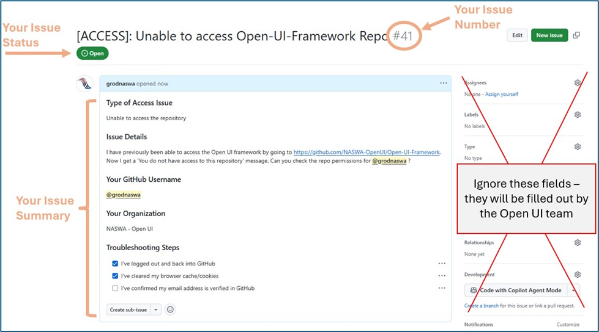

# Contributing Guide

If you have additional questions or are interested in learning about more ways to work with the Open UI Initiative, please email us at [openui@naswa.org](mailto:openui@naswa.org). You can also visit our [website](https://www.naswa.org/open-ui-initiative) for more information about the Open UI Initiative.

## Table of Contents
1. [Submitting Feedback](#submitting-feedback)
2. [GitHub Terms and Usage guide](#github-terms-and-usage-guide)
3. [Open UI Writing and Style Guide](#open-ui-writing-and-style-guide)

 

## Submitting Feedback
If you would like to submit a comment or feedback on the contents of the Overview repository, please submit an Issue by following the instructions below:

1.  **Open the Issues tab**

    - Click the “Issues” tab at the top of the repository page

<b><i>Figure 1: Issue Tab</i></b>

2.  **Create a new issue**

    - Click the green “New issue” button

<b><i>Figure 2: New Issue Button</i></b>

3. **Fill out the issue by including a title and the description**

    - Please be specific to help us address your feedback efficiently

    - If you are unsure about any field, please reach out to our team
      for help at openui@naswa.org and we will follow up with you

5.  **Submit your issue**

    - Review the information you provided for completeness

    - Click the “**Create**” button

<b><i>Figure 3: Create New Issue Button</i></b>

- You’ll be redirected to a GitHub page with a summary of your issue

 

<b><i>Figure 4: Issue Confirmation Screen</i></b>

- This confirms that your issue has been successfully opened. It is
  informational and no further action is needed at this stage.

- You will also receive a confirmation email with a link to review the
  issue and add further comments throughout the resolution process.

### Managing Your Issue

#### Email Notifications

GitHub automatically sends notifications to your email address when:

- Your issue is created

- Someone comments on your issue

- The status of your issue changes

#### Responding to Updates

You can manage your issue entirely through email:

- Reply directly to any notification email

- Your reply will automatically be added as a comment to the GitHub
  issue

- You don’t need to log back into GitHub to continue the conversation

#### Adding More Information

If you need to provide additional details after submitting:

- Reply to any notification email about your issue

- Your response will be added as a comment

- You can attach files if needed

### What Happens After Submission

After you submit an issue:

1.  **Acknowledgment**: You’ll receive an automatic confirmation

2.  **Review**: The Open UI team will review your feedback

3.  **Updates**: You’ll receive email notifications about progress

4.  **Resolution**: You’ll receive a final response explaining the
    outcome

### Best Practices for Effective Feedback

To help us address your feedback efficiently:

- **Be specific**: Clearly identify what your feedback relates to

- **Provide context**: Explain why you’re submitting the feedback

- **Suggest solutions**: When possible, offer potential solutions

- **Include examples**: Use examples to illustrate your points

- **Be concise**: Focus on key information

### Additional Help

If you encounter any difficulties with this process, please contact
<openui@naswa.org> for assistance.

 

## GitHub Terms and Usage Guide

### Branch
Create your own workspace to make changes without affecting what others see. This lets you draft and experiment safely.

> **Example:** "I want to update a process document → I'll create a separate **branch** to work on my changes"

### Comment
Provide feedback, ask questions, or suggest edits on specific parts of documents.

> **Example:** "I have a suggestion about this paragraph → I'll add a **comment** to that specific section"

### Clone
Download a copy of the repository to your computer to work on files locally.

> **Example:** "I need to make several document updates → I'll **clone** the repository to my computer"

### Commit
Save your changes with a brief description of what you modified and why.

> **Example:** "I've finished updating the contact list → I'll **commit** these changes with a note explaining what I updated"

### Draft Pull Request
Work on changes and get early feedback before they're ready for final review.

> **Example:** "I've started updating the process guide but want early input → I'll create a **draft** PR to share my progress"

### Fork
Create your own copy of the repository that you can freely modify.

> **Example:** "I want to propose changes to our documentation → I'll **fork** the repo to work on my ideas"

### Issues
Start or join discussions about specific topics, track tasks, or suggest improvements.

> **Example:** "I noticed our FAQ needs updating → I'll open an **issue** to discuss this with the team"

### Labels
Add categories or status indicators to issues and pull requests to keep things organized.

> **Example:** "This document needs legal review → I'll add the 'legal-review' **label** so the right team sees it"

### Markdown (.md files)
The formatting language used in GitHub to create text documents with headers, lists, and other styling using simple symbols.

> **Example:** "I need to make this text bold → I'll add \*\* before and after the text in a **markdown** file"

### Merge
Combine approved changes from a pull request into the main document.

> **Example:** "The team has approved my updates → they will **merge** my changes into the main branch"

### Milestone
A way to group related issues or pull requests together to track progress toward a goal or deadline.

> **Example:** "These updates are for our Q2 release → I'll add them to the Q2 Documentation **milestone**"

### Projects
A way to view and organize work across multiple documents or tasks in a board-style layout.

> **Example:** "I want to see all documentation tasks in one place → I'll check our team's **Project** board."

### Pull Request (PR)
Share your proposed changes with the team and gather feedback before making them official.

> **Example:** "I've finished my document updates → I'll create a **pull request** so my changes can be reviewed"

### README
A file where that contains essential information about the repository and how to use it.

> **Example:** "I'm new to this project → I'll check the README for guidance on getting started."

#### Repository (Repo)
This is where you'll go to find, view, and work with all your team's documents and files. It is the team's shared workspace.

> **Example:** "I need to find the latest version of our style guide → I'll check our team's **repository**"

### Sync/Pull
Update your local copy with any changes others have made in the repository.

> **Example:** "Before I start working → I'll **sync** my branch to get the latest updates"

### Watch
Get notifications about changes or discussions in specific documents or areas you care about.

> **Example:** "I need to stay updated on changes to the compliance docs → I'll **watch** that folder">

 

## Open UI Writing and Style Guide

### Writing about the Open UI Initiative

Always leave a space between 'Open' and 'UI.' 

Refer to Open UI Initiative team as 'we,' not 'it.' 

Do not abbreviate the Open UI Initiative as OUI.

Capitalize specific ‘product’ names but not specific terms.

Capitalize ‘Monetary Determination Product Spec' but do not capitalize ‘monetary determination’ or ‘product spec’ when talking about them more generally. For example:

- We published the Monetary Determination Product Spec last week.

- We’re researching monetary determination policies and working on our process for creating product specs.

### Describing the Open UI Initiative
*Unabridged version*:

The Open UI Initiative seeks to create a blueprint, or framework, of an unemployment insurance (UI) system, based on the structure of UI systems across the U.S. We are calling this the Open UI Initiative Framework, and states and vendors can use this framework as a guide to develop their own UI software or to modernize existing systems with the flexibility to fit their policies and workflows.  

The framework will follow a modularized approach, or one where the system is sectioned by key functionalities, allowing for the ability to update, change, or replace parts of the system as needed rather than needing to overhaul the entire system all at once. The framework will describe how the modules will communicate with each other or be interoperable, and how they will communicate with other external systems.  

The Open UI Initiative Framework will be built with the collaboration and input of the UI community of states, vendors, subject matter experts, advocates, and federal partners, and we are committed to maintaining an open and transparent development process, with Initiative materials being kept in an easy to find digital repository. 

*Abridged version*:

- The Open UI Initiative is about creating a blueprint, or framework, of a UI system.

- The framework utilizes a modular design, allowing for parts of the system to be changed or updated.  

- The initiative is built in collaboration with the UI community of states, vendors, subject matter experts, advocates and federal partners. 

#### What the Open UI Initiative is not

At this point in time, we are not creating the actual software that users can interact with. The specifications within the framework (the blueprint) will be used to make these by the states/vendors themselves to fit their own workflows. 

#### Why is the Open UI Initiative important?
**Current UI Technology challenges:**

- Limited vendor pool leaves states with few choices around price and design  

- Difficult for new entrants to the market  

- Most vendors own the code for a state's UI system  

- Sporadic, insufficient funding for IT modernization

**Benefits of the Open UI Initiative**  

- Decreased barrier to entry for new vendors, increasing competition and innovation  

- State ownership of code  

- A community of contributors to the keeping the framework up to modern standards  

- Shorter build and implementation timelines since no need to start 'from scratch'

- Transparent and easy to find documentation 

#### What do we mean by open?

- We are open in our way of working with states, vendors, and others who want to contribute to the vision of the Initiative  

- We aim to open the UI technology marketplace to new ideas, vendors, and approaches  

- We see value and opportunity in open source software and communities 

### Where can people find more information? 

Visit the [Open UI Initiative website](https://www.naswa.org/open-ui-initiative) or reach out to the Open UI Initiative team at openui@naswa.org.  

***Feel free to copy and paste this text directly to use in emails and presentations!***

### Writing

#### General Guidelines

Some guidelines to consider when writing for the Open UI Initiative are to: 

- Be Transparent: When possible and appropriate, explain the reasoning behind decisions and strategies. Your communication should share what avenues were considered, or explored and ultimately not pursued.  Do share what worked, what did not work and why. 
  
- Be Informative: Our stakeholders should understand the information being communicated to them and easily navigate topics of interest. It is best practice to avoid jargon/ambiguity, define terms and acronyms and do not assume what stakeholders may or may not know. Writing should be approachable, use plain language and be appropriate for the specific audience. 
 
- Be Welcoming: Feedback should always be welcomed from our stakeholders and anyone interested/invested in our work. Be open to different points of view in the pursuit of delivering the best possible content.

#### Voice

NASWA’s “Voice” should reflect our values, conveying that we are experienced, compassionate partners. Voice should remain consistent regardless of the audience or the format. 

- Use plain language: As we work with states to help them enhance their communications, NASWA must serve as an example for members to follow. Aim to write in simple and straightforward terms. 

- Be respectful: Acknowledge all the ongoing hard work by states, the federal government, advocates, employers and claimants. 

#### Tone

While NASWA’s voice remains consistent across different formats and audiences, “tone” can adapt to each situation and audience. For example, tone will differ for a conference presentation versus a board presentation. In general, NASWA’s tone is *professional but approachable*.  

A ‘professional but approachable’ tone is direct, confident and thorough while also conveying respect and clarity. ‘Professional’ emphasizes facts and references data or rationales when explaining opinions or points of view.  

NASWA’s audiences include workforce professionals in a variety of roles. Content should be understood by all due to the wide variety of people our work could impact. 

#### Style Tips

**Write for all readers.** While NASWA’s primary stakeholder is its members, the content may be read by a wide audience, ranging from employers to claimants. NASWA’s work may gather the interest of those who are unfamiliar with the nuances yet still invested in the outcomes of what we do.  

While some of NASWA’s content will be very technical in nature, default to using best practices when you can, aiming to write content as accessible as possible. 

**Focus on your message.** Begin with the most important point or message. Group related ideas together and use descriptive headers and subheadings to create a hierarchy of information that is easy to read and comprehend.  

**Be concise and specific.** Use short words and sentences and avoid unnecessary phrases (e.g., ‘in order to’ vs. ‘to’). Avoid using adverbs unless required for clarity (e.g., 'very difficult’ vs. ‘difficult’). Avoid vague language or clarify phrases that might have other meanings in different contexts, such as UI (unemployment insurance versus user interface).  

#### Active Voice

Use active voice and avoid passive voice, if possible. 

In active voice, the subject of the sentence performs the action. In passive voice, the subject of the sentence has the action performed to it. Passive voice can make sentences unclear and vague because they shift focus away from the subject and make it unclear who is responsible. They can also sound wordy, indirect and can take up more space on the page. 

Example: 

✅The user logged into the account. 

❌The account was logged into by the user. 
 

Words such as 'was' and 'by' are common in sentences written in passive voice and can be good to scan for in your document when checking for active vs. passive voice. 

*Exception* - when you want to specifically emphasize an action. 

- “The account was flagged by the investigations team.” 

In other words, default to active voice and use your judgment on where passive voice might communicate a more appropriate tone or point of view. NASWA Communications can provide guidance and editing expertise. 

#### Abbreviations and acronyms 

As a general rule, spell out abbreviations on the first mention with the abbreviated form in parentheses next to it.  

- First use: National Association of State Workforce Agencies (NASWA) 

- Second use: NASWA 

If the abbreviation or acronym is well known, such as HTML, it can be used without writing out the full word on first use. 

If your documentation includes a high number of acronyms, consider including a glossary as an appendix.  

A list of common abbreviations that should be completely spelled out on first usage can be found below.  

- U.S. Department of Labor (USDOL) 

- Employment and Training Administration (ETA) 

- Office of Unemployment Insurance (OUI) 

- American Rescue Plan Act (ARPA) 

- Technical Advisory Group (TAG) 

- National Association of State Workforce Agencies (NASWA) 

- UI Information Technology Support Center (UI ITSC) 

These are just a few select terms that commonly come up in NASWA’s writing. 

**Do not abbreviate Open UI Initiative, it is spelled out every time.**

### Capitalization 

Capitalization rules change depending on the format and type of content. Title case capitalizes the first letter of every word in a sentence or phrase except articles, prepositions and conjunctions. Sentence case capitalizes the first letter of the first word in a sentence. Some examples are included below. 
  

Email addresses and websites 

When writing out an email address or website URL, use all lowercase. Watch out for autocorrect! 

- username@naswa.org 

- naswa.org 

#### Words within sentences 

Do not capitalize words in the middle of sentences unless they are proper nouns. Here are some words that are never capitalized in a sentence: 

- modernize / modernization 

- website 

- state

#### Contractions 

Avoid contractions in most long-form writing in order to maintain a professional tone. 

Instances where contractions may be okay to use are presentations where slide space is at a premium. 

#### Slang and jargon 

Write in plain, easy-to-understand terms. If you need to use a technical term, briefly define it so everyone can understand. 

### AP Style

Open UI and NASWA follow [AP Style](https://en.wikipedia.org/wiki/AP_Stylebook). NASWA Communications can help you adhere to AP style. Occasional exceptions may be made for space constraints or clarity, such as in a social media post. The following are some AP style basics to keep in mind:  

#### Punctuation 

NASWA <u>does not use</u> the Oxford Comma.  

- In a simple series, use commas to separate elements, but do not put a comma before the conjunction/last item in the list. (ex: The muffin recipe required flour, eggs and milk.)  

- Include the final comma only if omitting it would make the meaning unclear. 

- Include the final comma before the concluding conjunction if another element of the sentence requires a conjunction. (ex: Some classic sandwiches include BLT, tuna salad, grilled chicken, and peanut butter and jelly.)

#### Numbers 

Spell out numbers that begin a sentence. 

Spell out numbers one through nine. 

Use numerals for 10 and above. 

- Example: One million people filed for unemployment the week of October 7, 2024. 

Use numerals for figures, dimensions and percentages. 

Expressions that typically use spelled-out numbers can be left that way. 

- Example: That is a third-party integration. 

Numbers over three digits get commas: 

- 999 

- 1,000 

- 150,000 

Write out large numbers in full. Abbreviate them if there are space restraints, as in a presentation or a chart: 1k, 150k, 1.5 million.

#### Dates 

Spell out the month, use numbers instead of ordinal numbers, and include the year. 

✅ January 1, 2024 

❌ January 1st, 2024 

#### Decimals and fractions 

Spell out fractions. 

✅: two-thirds 

❌: 2/3 

Use decimal points for numbers that would be difficult to write out as a fraction, like 4.575 or 50.5.

#### Percentages 

Use the % symbol instead of spelling out 'percent.' 

#### Ranges and spans 

Use a hyphen (-) to indicate a range between numbers. 

- It takes 20-30 days. 

#### Time 

Use numerals and a.m. or p.m., with a space between. 

- 7 a.m. 

- 7:30 p.m. 

Use a hyphen between times to indicate a time period.
 

- 7 a.m.–10:30 p.m. 

Specify time zones when writing about an event or meeting. Since the NASWA office is in Washington D.C., we default to ET.

#### URLs and websites 

Capitalize the names of websites and web publications. Don’t italicize. 

In general, avoid writing out full URLs, but when you need to, leave off the [http://www.](http://www.)

#### State Names 

Generally, spell out state names and do not abbreviate them unless needed for spacing reasons.   
 

